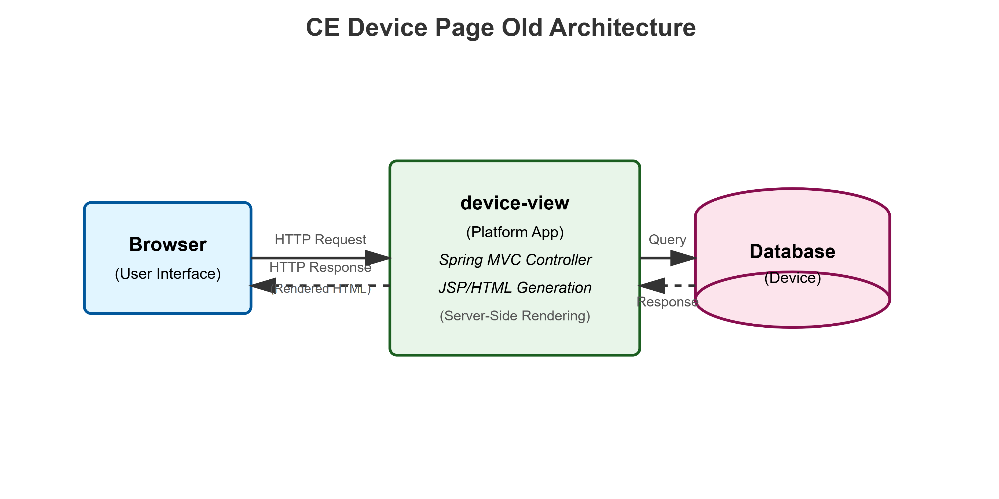
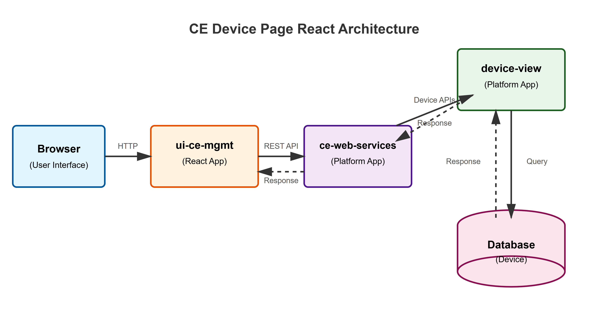
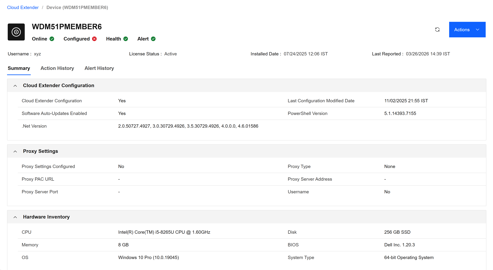

# Cloud Extender Settings UI Migration to React

## Project Description
MaaS360's Cloud Extender management interface currently runs on legacy JSP architecture.

This causes:
- Slow page loads
- Tight coupling with monolithic application
- Poor maintainability

We're migrating to a standalone React application using IBM Carbon Design System and Vite to improve performance, scalability, and maintainability.

---

## Business Objectives

### 1. Improve User Experience (UX)
* **Goal:** Drastically reduce initial load times and page transitions.
* **Impact:** A seamless, responsive UI that allows IT administrators to manage Cloud Extenders without waiting for global app assets to load.

### 2. Modernize UI Framework
* **Goal:** Transition from legacy views to **React.js** and **IBM Carbon Components**.
* **Impact:** Consistent design language with the rest of the MaaS360 ecosystem and access to modern frontend state management.

### 3. Decoupling & Scalability
* **Goal:** Isolate CE logic into a standalone React app to ensure independent execution and avoid cross-module interference.
* **Impact:** Independent deployment cycles during **DDs** and easier scaling of specific CE features without impacting the entire MaaS360 portal.

---

## Justification

Legacy JSP interface has major issues:
- Full page reloads for every action
- Mixed JSP/JavaScript/jQuery code is hard to maintain
- No component reusability

React migration solves these problems:
- Smaller bundle size
- Faster load times
- Independent deployment cycles
- Foundation for micro-frontend architecture

---

## Scope

- Analyze legacy JSP architecture and identify migration requirements
- Build standalone React app with Vite
- Integrate IBM Carbon Design System v1.104.1
- Develop views: Device Summary, Grid, Alerts, Actions, Action History, Certificates, Exchange, AD Auth, AD Visibility, Onboarding
- Create mock data for frontend development
- Design REST APIs using Spring Boot and JAX-RS

---

## Technical Details

### Legacy JSP Architecture (Old)

**How it works:**
- Browser sends HTTP request to device-view app
- JSP generates complete HTML page server-side
- Full page reload for every interaction
- Higher load time

**Problems:**
- Full page reloads required
- Server-side rendering overhead
- Tight coupling with monolith
- No component reusability
- Hard to maintain and debug

---

### New React Architecture (Proposed)

**How it works:**
- Browser loads React app
- React makes REST API calls to ce-web-services
- Backend returns JSON responses
- Client-side rendering with instant updates
- No page reloads needed

**Benefits:**
- Instant UI updates
- Independent deployment
- JSON API communication
- Reusable components
- Fast HMR development

---

## Technologies Used

- **React 19.2.4** – Component-based UI library with hooks
- **Vite 8.0.1** – Fast build tool (<1s start, <100ms HMR)
- **IBM Carbon Design System v1.104.1** – 50+ accessible components
- **SCSS (Sass)** – CSS preprocessor with variables and mixins
- **Carbon Icons React v11.77.1** – 2000+ SVG icons
- **Spring Boot** – Backend REST API framework
- **JAX-RS** – Java REST API standard

---

## Mock-ups

### Device Summary View

### CE Device Grid View

---

## Challenges Faced

**Build & Environment Configuration Issues**

**Carbon Design System Adoption**

**Responsive Layout Complexity**

---

## GitHub Link

Ui-ce-mgmt

---

## Future Enhancements (To Be Discussed)

---

**Team:** Naitik Gupta, Mansi Swaraj

**Mentors:** Anoop Pulakanti, Suresh Mudireddy

**Last Updated:** April 10, 2026
